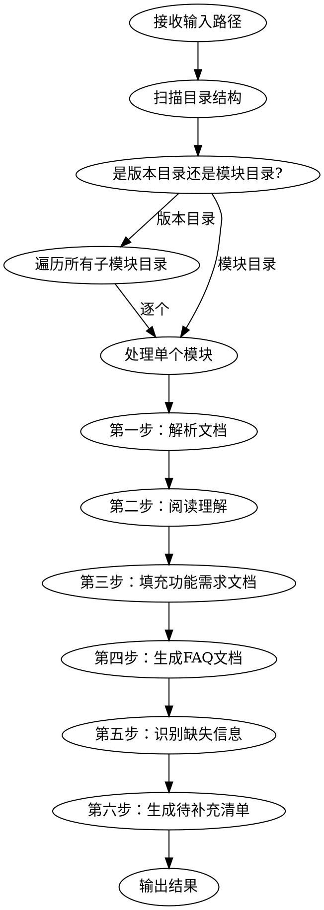

# 需求文档标准化整理

## 概述

将 Wiki 导出的混合格式需求文档（md、docx、xlsx、图片）阅读梳理后，按标准化模板输出结构化的功能需求文档和 FAQ 文档，并自动识别信息缺失部分生成待补充清单。

## 使用方式

用户调用：`/standardize-wiki-docs`

需要两个输入：

1. **需求文档路径**：Wiki 导出的文档目录（如 `WikiResource/V1.0.0/01-样本中心产品设计文档`，也可以是整个版本目录如 `WikiResource/V1.0.0`）
2. **标准化模版路径**：包含标准模板的目录（如 `标准模版/`）

如果用户未提供路径，逐一询问。

## 处理流程



### 第一步：解析文档

1. 扫描目标目录，识别所有文件类型
2. 运行 `parse_docs.py` 将 docx/xlsx 转为可读文本：
   ```bash
   python .claude/skills/standardize-wiki-docs/parse_docs.py "<需求文档路径>" --latest
   ```
3. 脚本在目标目录下生成 `_parsed/` 子目录
4. 对 `.md` 文件，直接用 Read 工具读取
5. 对图片文件（png/jpg/jpeg/gif），用 Read 工具查看（多模态识别），将图片内容转为结构化文本描述

**优先级规则**：

- 如果存在 `converted_markdown/` 目录，优先读取其中的 md 文件作为主文档
- 同名多版本文档（如 PRD文档1014、1203），只读取最新版本（`--latest` 参数自动处理）
- docx 原文件作为补充参考

### 第二步：阅读理解全部内容

**必须完整阅读所有文档后再开始整理**，建立全景理解：

- 系统包含哪些模块/功能
- 各模块的核心业务流程
- 涉及哪些角色和权限
- 字段规则和数据规则（重点关注 Excel 中的字段定义）
- UI 原型和交互流程（从图片中识别）
- 各功能的输入输出和异常处理

**Excel 内容处理要点**：

- 字段规则 Excel：逐行读取字段名、类型、必填/选填、校验规则、默认值等，完整填入功能需求文档的「数据规则」表格
- 送检单/导出模板 Excel：理解字段结构，提取为功能描述中的输入输出说明
- 测试用例 Excel：提取关键测试场景，填入验收标准

**图片内容处理要点**：

- UI 原型截图：识别页面布局、按钮位置、表单字段，转为界面原型描述
- 流程图：识别流程节点和流转关系，转为功能流程文字描述
- 数据流图：识别数据流向，转为依赖关系说明

### 第三步：填充功能需求文档

读取标准模板 `标准化模板-功能需求文档.md`，按模板结构逐节填充：

| 模板章节     | 填充来源             | 填充要点                                              |
| ------------ | -------------------- | ----------------------------------------------------- |
| 文档元数据   | 原文档基本信息       | 文档ID按 REQ-[项目]-[编号] 格式生成，关键词从内容提取 |
| 需求概述     | PRD 背景章节         | 提取问题描述、业务价值、目标用户                      |
| 功能详细说明 | PRD 功能描述 + 图片  | 核心功能、场景、流程、输入输出                        |
| 功能规则     | 字段规则 Excel + PRD | 业务规则、数据规则表格、权限规则                      |
| 界面原型     | 图片识别结果         | 页面位置、交互说明、原型描述                          |
| 异常处理     | PRD 异常章节         | 异常场景、错误提示、处理方式                          |
| 非功能性需求 | PRD 非功能章节       | 性能、兼容性、安全要求                                |
| 依赖关系     | 跨模块引用分析       | 前置依赖、影响范围                                    |
| 验收标准     | 测试用例 Excel       | 功能验收点、测试用例                                  |
| FAQ          | 常见问题提取         | 从需求中提炼用户可能的问题                            |

**填充原则**：

- 有内容就填，没有的标注 `[待补充]`
- 保持原文档的准确信息，不臆造内容
- Excel 表格数据要完整转录，不遗漏字段
- 图片识别的内容要标注 `[来源：图片识别]`，提醒产品经理校验

### 第四步：生成 FAQ 文档

读取标准模板 `标准化模板-FAQ问答文档.md`，从需求文档中提炼 FAQ：

**FAQ 提取来源**：

- 功能操作类：从功能描述中提炼"如何做XX"类问题
- 规则说明类：从业务规则中提炼"为什么XX"类问题
- 异常处理类：从异常场景中提炼"XX怎么办"类问题
- 字段说明类：从字段规则中提炼"XX字段是什么意思"类问题

**FAQ 编号规则**：`FAQ-[模块缩写]-[序号]`

### 第五步：识别缺失信息

对照标准模板，逐节检查是否有信息缺失：

**必须检查的缺失项**：

- 文档元数据中的空字段
- 需求概述中缺少的背景/价值/用户说明
- 功能流程中缺少的步骤或分支
- 数据规则表格中缺少的字段定义
- 权限规则中缺少的角色定义
- 异常处理中缺少的场景覆盖
- 非功能性需求中缺少的指标
- 验收标准中缺少的测试用例
- 界面原型中缺少的交互说明

### 第六步：生成待补充清单

将所有缺失信息整理为 JSON，然后运行：

```bash
python .claude/skills/standardize-wiki-docs/generate_gaps.py "<JSON文件路径>" "<输出Excel路径>"
```

JSON 格式：

```json
[
  {
    "id": 1,
    "module": "所属模块",
    "section": "对应模板章节",
    "field": "缺失的具体字段/内容",
    "priority": "必填|建议补充|可选",
    "context": "当前已有的相关信息（帮助产品经理理解上下文）",
    "suggestion": "建议补充的方向或示例"
  }
]
```

## 输出文件

每个模块在输出目录下生成：

```
<输出目录>/
  <模块名>/
    功能需求文档.md          # 按标准模板填充的功能需求文档
    FAQ问答文档.md           # 按标准模板生成的FAQ文档
    待补充清单_YYYYMMDD.xlsx  # 缺失信息清单
```

输出目录默认为需求文档路径下的 `_standardized/` 子目录。

## 质量要求

- **完整性**：Excel 中的每一行数据都要读取并整理，不能遗漏
- **准确性**：保持原文档信息的准确性，不臆造不存在的内容
- **可追溯**：图片识别的内容标注来源，方便产品经理校验
- **实用性**：待补充清单要具体到字段级别，附带上下文，方便产品经理快速补充
- **标准化**：严格按照标准模板的格式和结构输出

## 常见问题

| 问题                       | 处理方式                                                    |
| -------------------------- | ----------------------------------------------------------- |
| 图片无法识别               | 在文档中标注 `[图片无法识别，请人工补充]`，并加入待补充清单 |
| Excel 文件损坏             | 跳过该文件，在待补充清单中记录                              |
| 多版本文档内容冲突         | 以最新版本为准，在文档中标注版本来源                        |
| 模板中某章节完全无对应内容 | 保留章节标题，内容填 `[待补充]`，加入待补充清单             |
| 需求文档路径下无子模块     | 将整个目录视为单个模块处理                                  |
